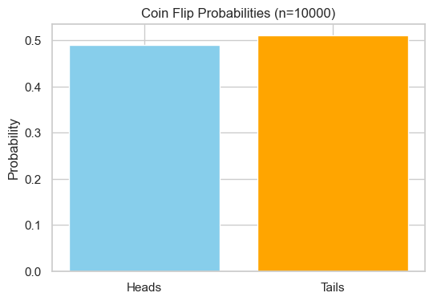
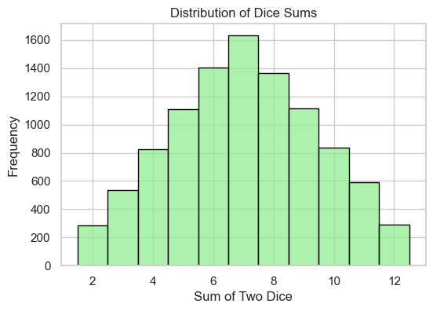
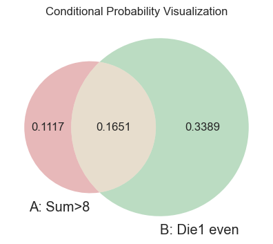
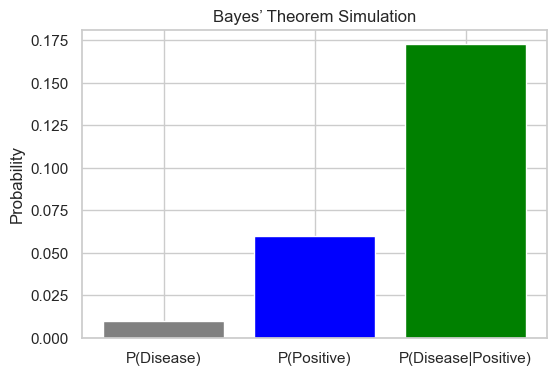

# 🎲 Probability Simulator — Chapter 2  
*A part of the “Mastering Statistics in Python” series by Pranav Alok*


A **simulation-based Python notebook** that explores the mathematical foundations of **probability theory** — including event frequencies, conditional probability, independence, and **Bayes’ theorem** — through intuitive **randomized experiments** and **visualizations**.

This notebook transforms classical probability formulas into real, observable phenomena — helping learners *see randomness, rather than just compute it.*

---

## 🧠 Motivation

This project is the **second chapter** in my ongoing *Mastering Statistics in Python* series.  
It moves beyond descriptive summaries (Chapter 1) and introduces the **language of uncertainty** — probability.  

> Every branch of statistics — inference, regression, or machine learning — is built upon the logic of probability.

Through simulation and visualization, this notebook aims to:
- Build intuition for probability as long-run frequency.
- Visualize random events and their interactions.
- Connect theoretical rules (like \(P(A|B) = \{P(A∩B)}/{P(B)}\)) to simulation-based outcomes.

---

## ⚙️ Features

✅ **Simulate fundamental probability experiments**
- Coin flips → \( P(\{Heads}) \), \( P(\{Tails}) \)
- Two dice → \( P(\{Sum}=7) \), histogram of sums  

✅ **Estimate conditional and joint probabilities**
- Compute \( P(A|B) \), \( P(A∩B) \), and test independence  

✅ **Bayes’ theorem in action**
- Simulate diagnostic test scenarios  
- Visualize prior, likelihood, and posterior probabilities  

✅ **All results and visuals inline**
- Fully self-contained **Jupyter Notebook**  
- Inline plots: histograms, bar charts, Venn diagrams  
- No file exports needed — all outputs are visible in one place  

---

## 🧩 Conceptual Overview

| Concept | Description | Visual |
|----------|--------------|---------|
| **Empirical Probability** | Estimate probabilities by simulation instead of counting outcomes. |  |
| **Dice Sum Distribution** | Visualize how sums 6–8 are more frequent. |  |
| **Conditional Probability** | Visualize \( P(A|B) \) using overlapping Venn diagrams. |  |
| **Bayesian Updating** | Show how new evidence updates prior beliefs. |  |

*(All images are generated directly inside the notebook.)*

---

## 🧮 Core Probability Concepts

| Concept | Formula | Demonstrated Through |
|----------|----------|----------------------|
| **Empirical Probability** | \( P(A) ≈ \{\{Favorable Outcomes}}/{\{Total Outcomes}} \) | Coin flips, dice rolls |
| **Conditional Probability** | \( P(A/B)=\{P(A ∩ B)}/{P(B)} \) | Dice experiment |
| **Independence** | \( P(A ∩ B) = P(A)*P(B) \) | Independence test |
| **Bayes’ Theorem** | \( P(H/E) = \{P(E/H)P(H)}/{P(E/H)*P(H) + P(E/neg H)*P(neg H)} \) | Disease testing simulation |

Each formula is **simulated empirically** — reinforcing mathematical reasoning through data-driven observation.

---

## 🧰 Libraries Used

| Library | Purpose |
|----------|----------|
| `numpy` | Efficient random number generation & vectorized calculations |
| `matplotlib` / `seaborn` | Data visualization (histograms, barplots) |
| `matplotlib_venn` | Illustrative Venn diagrams for conditional probability |
| `random` | Simple random draws for coin/dice simulations |

---

## 📗 Notebook Structure
```bash
Probability_Simulator.ipynb
│
├── 1. Introduction
├── 2. Imports & Setup
├── 3. Coin Flip Simulation
├── 4. Dice Sum Distribution
├── 5. Conditional Probability
├── 6. Independence Check
├── 7. Bayes’ Theorem Simulation
└── 8. Summary of Results
 ```

Each section contains both **theory (Markdown)** and **simulation (Python code)** — a perfect balance between conceptual clarity and computational practice.

---

## 🧾 Example Outputs

### 🎯 Simulation Results
| Experiment | Estimated Probability |
|-------------|----------------------|
| Coin Flip (P(Heads)) | 0.502 |
| Dice Sum (P(Sum=7)) | 0.166 |
| Conditional P(A|B) | 0.415 |
| Bayes’ Posterior P(Disease|Positive) | 0.166 |

*(Results vary slightly between runs — illustrating natural random variation.)*

---

## 🧭 Learning Outcomes

By working through this notebook, I have learned to:
- Connect **mathematical definitions** of probability with **empirical evidence**.
- Interpret **conditional relationships** visually and numerically.
- Apply **Bayes’ theorem** to real-world uncertainty (e.g., disease testing).
- Use simulation as a bridge between **theory and application**.

---

## 🚀 How to Run This Notebook

### 1️⃣ Clone the repository
```bash
git clone https://github.com/<your-username>/probability-simulator.git
cd probability-simulator
```

### 2️⃣ Install dependencies
```bash
pip install numpy matplotlib seaborn matplotlib-venn
```

### 3️⃣ Launch Jupyter Notebook
```bash
jupyter notebook Probability_Simulator.ipynb
```

### Part of the “Mastering Statistics in Python” Series
| Chapter | Project                                                                                          | Focus Area                                                   |
| ------- | ------------------------------------------------------------------------------------------------| ------------------------------------------------------------  |
| ✅ 1    | [Descriptive Statistics Analyzer](https://github.com/PranavAlok/descriptive-statistics-analyzer) | Summarizing and visualizing datasets                         |
| 🔜 2    | **Probability Simulator**                                                                        | Simulating randomness & probability laws                     |
| 🔜 3    | Discrete Distributions Explorer                                                                  | Understanding Binomial, Poisson, and Geometric distributions |
| 🔜 4    | Continuous Distributions Visualizer                                                              | Normal, Exponential, Gamma distributions                     |

# Author
**Pranav Alok**
**B.Sc. Analytics & Sustainability Studies, TISS Mumbai**
**🎯 Focus: Data Analytics | Probability | Environmental Statistics**
🌐 [LinkedIn](https://www.linkedin.com/in/pranav-alok-aa0664338)

## License
This project is licensed under the MIT License — you’re free to use, modify, and share with attribution.

## Acknowledgement
Built as part of the Mastering Statistics learning project — integrating mathematical theory, Python programming, and simulation-based understanding.

>“The beauty of probability lies not in predicting one event —
>but in understanding the pattern hidden in uncertainty.”


